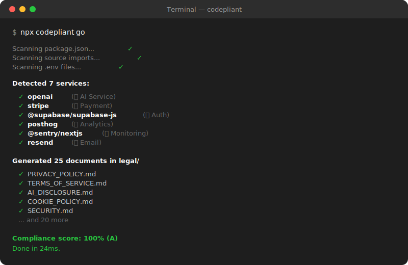

<p align="center">
  
</p>

<h1 align="center">Codepliant</h1>

<p align="center">
  <strong>Compliance documents from your actual code. Not questionnaires.</strong>
</p>

<p align="center">
  <code>npx codepliant go</code>
</p>

<p align="center">
  
  
  
  
  
</p>

---

## Your app collects user data. Where are your legal documents?

You added Stripe last week. OpenAI the week before. Supabase for auth. PostHog for analytics. Sentry for error tracking.

Each one collects user data. Each one requires disclosure in your privacy policy. And starting **August 2, 2026**, the EU AI Act requires you to disclose every AI system in your application — with fines up to **EUR 35 million**.

**Do you know exactly what data your app collects?** Most developers don't. Especially when half the code is AI-generated.

---

## One command. Every document you need.

```bash
npx codepliant go
```

Codepliant reads your actual source code — not a questionnaire — and generates every compliance document your project requires.

```
Scanning package.json...     ✓ 7 services detected
Scanning source imports...   ✓ OpenAI, Stripe found in code
Scanning .env...             ✓ 9 API keys detected
Scanning Prisma schema...    ✓ User model: email, phone, passwordHash

Generated 40+ documents in legal/

  PRIVACY_POLICY.md             — mentions Stripe, OpenAI, Supabase by name
  AI_DISCLOSURE.md              — EU AI Act Art. 50 compliant
  TERMS_OF_SERVICE.md           — SaaS terms with arbitration clause
  COOKIE_POLICY.md              — PostHog cookies listed specifically
  DATA_PROCESSING_AGREEMENT.md  — GDPR Art. 28, lists your sub-processors
  INCIDENT_RESPONSE_PLAN.md     — 72-hour GDPR breach notification
  DATA_DICTIONARY.md            — every data field cataloged with sensitivity
  ACCESS_CONTROL_POLICY.md      — RBAC, password policy, MFA requirements
  CHANGE_MANAGEMENT_POLICY.md   — code review, deployment, rollback procedures
  ... and 30+ more

Compliance score: 100% (A)
Done in 24ms.
```

**Every document mentions your actual services by name.** Not "third-party analytics providers" — it says "PostHog" because it found PostHog in your code.

<p align="center">
  
</p>

---

## The problem with existing tools

| You go to Termly/Iubenda... | You use Codepliant... |
|---|----|
| "Do you collect email addresses?" — *I think so?* | Reads `email: String @unique` from your Prisma schema |
| "Do you use cookies?" — *Probably?* | Finds PostHog, Google Analytics, Supabase Auth in your code |
| "Do you use AI?" — *Yes but what do I disclose?* | Detects OpenAI + Anthropic, generates Article 50 disclosure |
| "List your sub-processors" — *Uhh...* | Finds Stripe, Sentry, Resend, generates the full list with their DPA URLs |
| 30 minutes of forms → generic template | 30 seconds → 40+ documents tailored to your code |

---

## Who uses this

**SaaS founders** — "I need a privacy policy before launch. I don't have $2,000 for a lawyer and I don't know what half my dependencies collect."

**Developers** — "I added OpenAI last sprint. Now I need to update the privacy policy, add an AI disclosure, and figure out what the EU AI Act requires. I don't want to spend a day on this."

**CTOs preparing for audit** — "Investors want SOC 2 readiness docs. I need a privacy impact assessment, incident response plan, data processing agreements, and a third-party risk assessment. Yesterday."

**Agencies** — "I manage 15 client projects. Each needs compliance docs. `codepliant scan-all ./clients` runs them all in one shot."

---

## What it detects (from your actual code)

```
package.json:    "stripe": "^14.0"       → Payment data collection
source code:     import OpenAI from "openai"  → AI usage, needs disclosure
.env:            SENTRY_DSN=https://...   → Error monitoring, collects IPs
Prisma schema:   email String @unique     → Personal data storage
API route:       POST /api/chat { email } → Data intake endpoint
docker-compose:  postgres, redis          → Data persistence infrastructure
```

Supports: JavaScript/TypeScript, Python, Go, Ruby, Elixir, PHP, Rust, Java, .NET, Django — and frameworks like Rails, Laravel, Express, FastAPI.

## What it generates

**Legal** — Privacy Policy (GDPR Art. 13), Terms of Service, Cookie Policy, Data Processing Agreement

**AI Compliance** — AI Disclosure (EU AI Act Art. 50), AI Model Card (Art. 53), AI Act Checklist

**Security** — Security Policy, Incident Response Plan, Vulnerability Scan, Access Control Policy, Change Management Policy

**Operations** — DSAR Handling Guide, Consent Management Guide, Data Retention Policy, Data Dictionary

**Audit** — SOC 2 Checklist, ISO 27001 Checklist, Privacy Impact Assessment, Third-Party Risk Assessment, Data Classification, Risk Register

**Output formats** — Markdown, HTML, PDF, JSON, Notion, Confluence, cookie consent banner, embeddable widget, 12+ formats total

[See example output from a real SaaS project →](./examples/sample-output/)

---

## Tested against real projects

We scanned 100 open-source projects. Here are 10:

| Project | Stack | Services Found |
|---------|-------|---------------|
| [cal.com](./examples/real-projects/cal-com/) | Next.js + Prisma | 23 services |
| [chatwoot](./examples/real-projects/chatwoot/) | Ruby/Rails | 24 services |
| [twenty](./examples/real-projects/twenty/) | NestJS | 19 services |
| [documenso](./examples/real-projects/documenso/) | Next.js + Prisma | 16 services |
| [maybe](./examples/real-projects/maybe/) | Ruby/Rails | 16 services |
| [medusa](./examples/real-projects/medusa/) | Express | 14 services |
| [mastodon](./examples/real-projects/mastodon/) | Ruby/Rails | 14 services |
| [formbricks](./examples/real-projects/formbricks/) | Next.js | 13 services |
| [saleor](./examples/real-projects/saleor/) | Django | 5 services |

100% precision — when we detect something, it's real.

[See all scan results →](./examples/real-projects/)

---

## Get started

```bash
# Generate compliance documents
npx codepliant go

# Interactive setup
npx codepliant init

# Just scan (no files generated)
npx codepliant scan

# HTML compliance page for your website
npx codepliant go --format html

# Check if docs are up to date
npx codepliant check

# Compliance dashboard
npx codepliant dashboard
```

### Configuration

```json
{
  "companyName": "Your Company",
  "contactEmail": "privacy@company.com",
  "jurisdictions": ["gdpr", "ccpa", "uk-gdpr"],
  "dpoEmail": "dpo@company.com"
}
```

### CI/CD

```yaml
- uses: codepliant/codepliant@v50
  with:
    fail-on-missing: true
```

### MCP Server (Claude Code / Cursor)

```json
{ "mcpServers": { "codepliant": { "command": "npx", "args": ["codepliant-mcp"] } } }
```

---

## Links

- [Example Output](./examples/sample-output/) — 40+ generated documents
- [Real Project Scans](./examples/real-projects/) — 10 open-source projects
- [Contributing](./CONTRIBUTING.md)
- [Changelog](./CHANGELOG.md)

## License

MIT — free forever.

---

*Zero network calls. Your code never leaves your machine. [Verify it.](./src/scanner/no-network.test.ts)*
