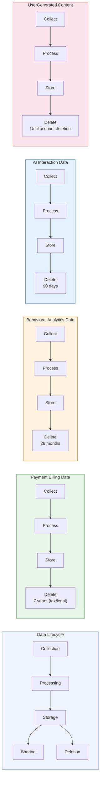

# Data Lifecycle Diagram — [Your Company Name]

> Auto-generated by Codepliant on 2026-03-16.
> Shows the full data lifecycle from collection through deletion for each data type.
> **Document Version:** 1.0  
> **Document Owner:** [Your Company Name]  
> **Next Review Date:** 2027-03-16

## Lifecycle Overview

All personal data processed by this application follows a defined lifecycle:

**Collection** — Data is gathered from users or systems
**Processing** — Data is used for its intended purpose
**Storage** — Data is persisted with appropriate safeguards
**Sharing** — Data may be transferred to authorized third parties
**Deletion** — Data is removed per retention schedule or on request

## Lifecycle Diagram

## Retention Summary

| Data Type | Retention Period | Deletion Trigger |
|-----------|-----------------|------------------|
| Payment & Billing Data | 7 years (tax/legal) | Transaction records retained per legal obligation |
| Behavioral & Analytics Data | 26 months | Automatic expiry after retention period |
| AI Interaction Data | 90 days | Auto-purged after retention window |
| User-Generated Content | Until account deletion | On user request or account deletion |

## Detailed Lifecycle per Data Type

### Payment & Billing Data

**Sources:** stripe

| Stage | Description |
|-------|-------------|
| Collection | Checkout flow, subscription management, invoicing |
| Processing | Payment tokenization, fraud detection, tax calculation |
| Storage | Tokenized by payment processor; no raw card data stored |
| Sharing | Payment processor, tax authority (as required by law) |
| Retention | 7 years (tax/legal) |
| Deletion | Transaction records retained per legal obligation; tokens revoked on request |

### Behavioral & Analytics Data

**Sources:** posthog

| Stage | Description |
|-------|-------------|
| Collection | Page views, clicks, session recordings, feature usage |
| Processing | Aggregation, segmentation, funnel analysis |
| Storage | Analytics provider cloud infrastructure |
| Sharing | Analytics provider; may be shared with advertising partners |
| Retention | 26 months |
| Deletion | Automatic expiry after retention period; on opt-out via consent preferences |

### AI Interaction Data

**Sources:** @anthropic-ai/sdk, openai

| Stage | Description |
|-------|-------------|
| Collection | User prompts, queries, uploaded content for AI processing |
| Processing | Inference, content generation, classification |
| Storage | Temporarily cached by AI provider during processing |
| Sharing | AI provider API; subject to provider data processing terms |
| Retention | 90 days |
| Deletion | Auto-purged after retention window; immediate on DSAR request |

### User-Generated Content

**Sources:** Active Storage, CarrierWave, UploadThing

| Stage | Description |
|-------|-------------|
| Collection | File uploads, form submissions, user-created content |
| Processing | Validation, transformation, indexing |
| Storage | Database and/or object storage with encryption at rest |
| Sharing | Not shared externally unless user explicitly shares |
| Retention | Until account deletion |
| Deletion | On user request or account deletion; backups purged within 30 days |

## Lifecycle Stage Details

### Collection

Data is collected through the following channels:

- **Payment & Billing Data**: Checkout flow, subscription management, invoicing
- **Behavioral & Analytics Data**: Page views, clicks, session recordings, feature usage
- **AI Interaction Data**: User prompts, queries, uploaded content for AI processing
- **User-Generated Content**: File uploads, form submissions, user-created content

### Processing

Data is processed for the following purposes:

- **Payment & Billing Data**: Payment tokenization, fraud detection, tax calculation
- **Behavioral & Analytics Data**: Aggregation, segmentation, funnel analysis
- **AI Interaction Data**: Inference, content generation, classification
- **User-Generated Content**: Validation, transformation, indexing

### Storage

Data is stored with the following safeguards:

- **Payment & Billing Data**: Tokenized by payment processor; no raw card data stored
- **Behavioral & Analytics Data**: Analytics provider cloud infrastructure
- **AI Interaction Data**: Temporarily cached by AI provider during processing
- **User-Generated Content**: Database and/or object storage with encryption at rest

### Sharing

Data sharing is limited to:

- **Payment & Billing Data**: Payment processor, tax authority (as required by law)
- **Behavioral & Analytics Data**: Analytics provider; may be shared with advertising partners
- **AI Interaction Data**: AI provider API; subject to provider data processing terms
- **User-Generated Content**: Not shared externally unless user explicitly shares

### Deletion

Data deletion follows these procedures:

- **Payment & Billing Data**: Transaction records retained per legal obligation; tokens revoked on request
- **Behavioral & Analytics Data**: Automatic expiry after retention period; on opt-out via consent preferences
- **AI Interaction Data**: Auto-purged after retention window; immediate on DSAR request
- **User-Generated Content**: On user request or account deletion; backups purged within 30 days

---

*This data lifecycle diagram is generated from automated code analysis. Actual data flows may include additional processing not captured by code scanning. This does not constitute legal advice. Have this document reviewed by qualified compliance professionals.*
